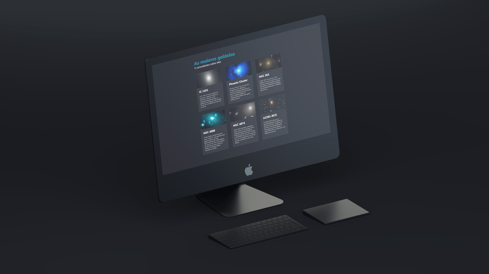

  
  

## 🖥️ Projeto

Esse é um projeto WEB das maiores galáxias e suas curiosidades, utilizando a propriedade GRID.

## 🚀 Tecnologias

Esse projeto foi desenvolvido durante o curso Explorer da Rocketseat com as seguintes tecnologias:

- HTML
- CSS
- Git e Github

## 💡 Conhecimentos Adquiridos

- Utilização da propriedade **GRID**.
- Utilização da propriedade **OVERFLOW**.